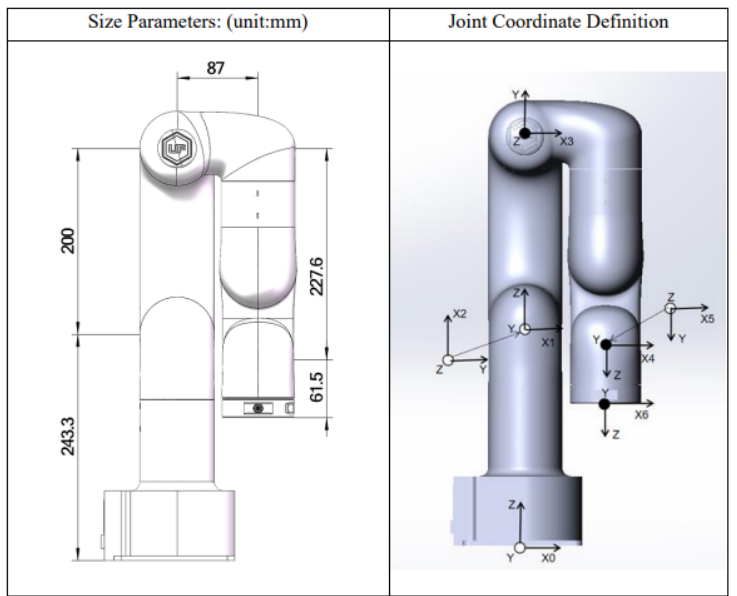
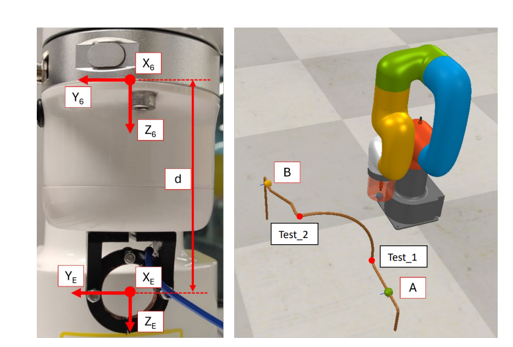

# Robotic Arm Trajectory Simulation

This repository contains Python scripts and resources for simulating and visualizing trajectories for a 6-DOF robotic arm using CoppeliaSim. The project focuses on controlling a robotic arm equipped with a parallel jaw gripper, ensuring it follows a predefined path consisting of straight-line and circular segments around a copper pipe.

## Overview

The primary objective of this project is to generate valid and safe trajectories for a 6-DOF robotic arm. The robot is tasked with moving from an initial pose to a target pose while avoiding collisions and respecting joint limits. The project leverages Python scripts for trajectory generation and visualization within the CoppeliaSim environment.

## Achievements

### The following tasks were accomplished in this project:

1. **Robot Kinematic Model Definition**:
   - Defined a 6-DOF robotic arm model with accurate joint limits and kinematic chain using the `roboticstoolbox` and `spatialmath` libraries.

2. **Pose Definition**:
   - Specified start, end, and test poses in the task space, as well as the center point for circular trajectories.

3. **Trajectory Generation**:
   - Developed functions to generate linear and circular trajectories for the robotic arm:
     - **Linear Trajectory**: A straight-line path between two poses in the task space.
     - **Circular Trajectory**: A circular path defined by a start pose, an end pose, and a center point.

4. **Inverse Kinematics with Joint Limits**:
   - Implemented an inverse kinematics function that respects joint limits, ensuring valid joint angles for each point in the generated trajectory.

5. **Simulation in CoppeliaSim**:
   - Integrated the generated trajectories with the CoppeliaSim environment to visualize the robotic arm's motion following the calculated paths.

6. **Collision Avoidance**:
   - Ensured that the generated trajectories allow the robotic arm to move safely without colliding with the environment, particularly the copper pipe.

## Repository Structure

The repository is organized as follows:

```
|-- src
|   |-- robot_kinematic_model_traj.ttt
|   |-- trajectories.py
|   |-- visualiseRobotInCoppeliaSIM.py
|   |-- figure_geometry_gripper.png
|   |-- figure_end_effector_frame_task.png
|   |-- requirements.txt
|-- README.md
```

### Key Files

- **`robot_kinematic_model_traj.ttt`**: CoppeliaSim scene file containing the robot model and simulation environment.
- **`trajectories.py`**: Contains functions for generating linear and circular trajectories for the robot.
- **`visualiseRobotInCoppeliaSIM.py`**: Script for visualizing the robot’s trajectory in CoppeliaSim.
- **`figure_geometry_gripper.png`**: An image illustrating the geometry of the robotic gripper.
- **`figure_end_effector_frame_task.png`**: An image depicting the end-effector frame and task layout.
- **`requirements.txt`**: A file listing the required Python packages for running the scripts.

### Robot Structure and Task Layout

The 6-DOF robotic arm used in this project is illustrated in the images below. The arm is equipped with a parallel jaw gripper and is designed to follow complex trajectories in a 3D space while avoiding collisions with its environment.

#### Gripper Geometry



#### End Effector Frame and Task Layout



## Installation

1. **Clone the Repository**:
   ```bash
   git clone https://github.com/Mahmood-Anaam/robotic-arm-trajectory-simulation.git
   cd robotic-arm-trajectory-simulation/src
   ```

2. **Install Required Python Libraries**:
   ```bash
   pip install -r requirements.txt
   ```

3. **Install CoppeliaSim**:
   - Download and install from [CoppeliaSim’s official website](https://www.coppeliarobotics.com/).
   - Load the `robot_kinematic_model_traj.ttt` scene file.

## Usage

1. **Generate Trajectories**:
   - The `trajectories.py` script contains functions for generating both linear and circular trajectories for the robot. These functions are utilized in the `visualiseRobotInCoppeliaSIM.py` script to create and visualize the robot's motion.

2. **Visualize in CoppeliaSim**:
   - Open CoppeliaSim and load the `robot_kinematic_model_traj.ttt` scene.
   - Run the `visualiseRobotInCoppeliaSIM.py` script to generate the trajectory using the functions from `trajectories.py` and visualize the robot following this trajectory:
     ```bash
     python visualiseRobotInCoppeliaSIM.py
     ```
   - The robot should now follow the prescribed path in the simulation environment.
